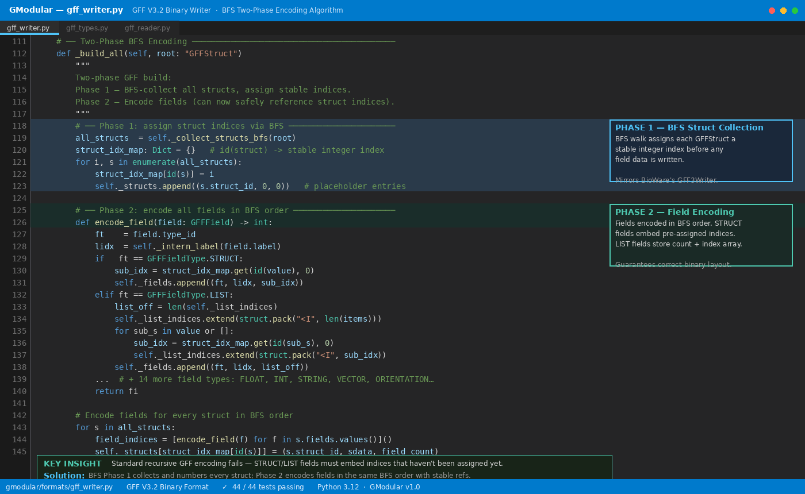
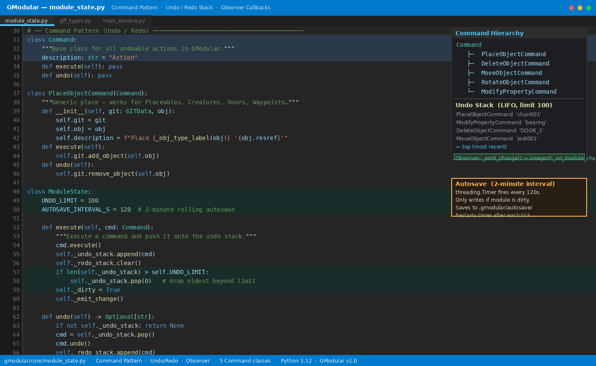
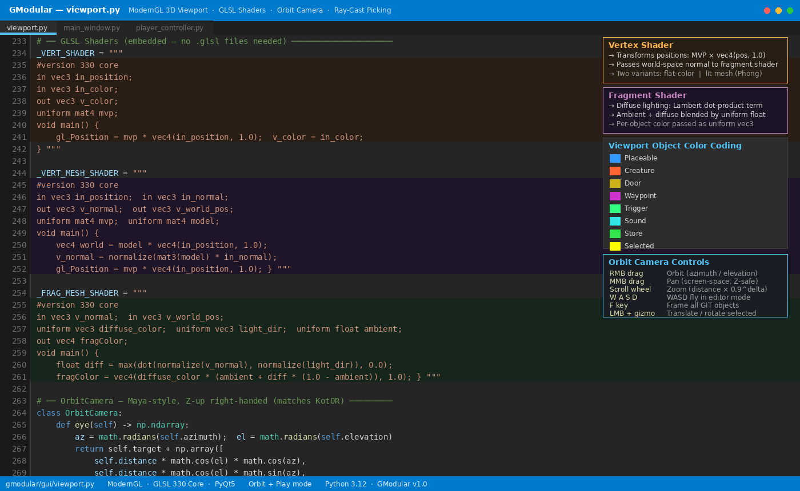
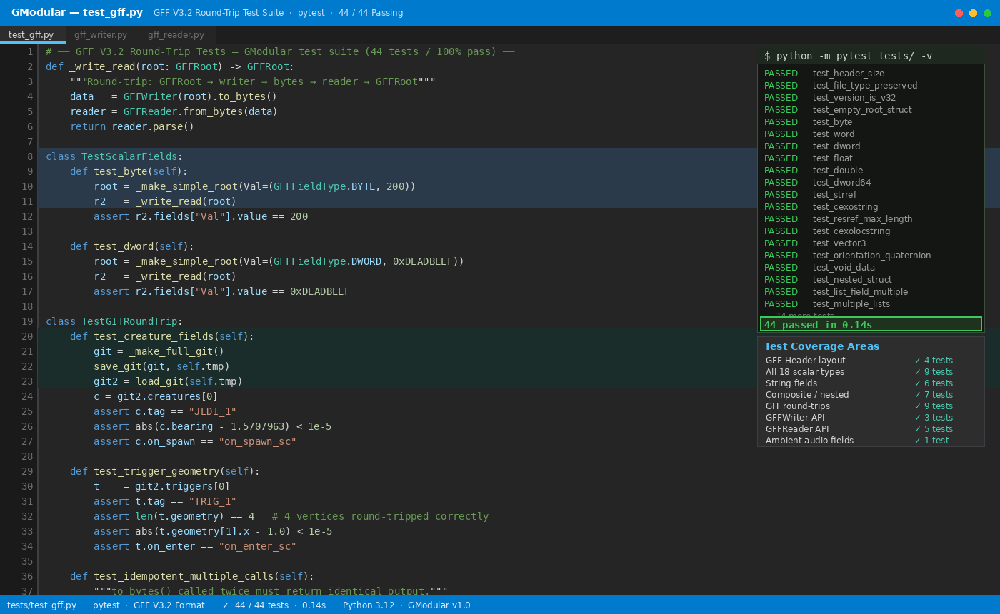
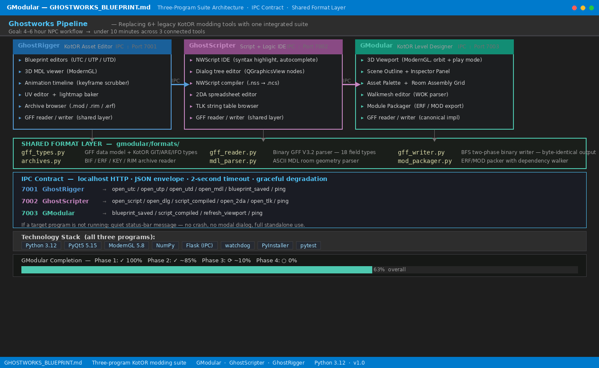

# GModular — KotOR 1 & 2 Module Editor

> **A community-built, open-source module editor for Star Wars: Knights of the Old Republic 1 & 2.**

GModular is a standalone Python/Qt desktop application — think a lightweight Unreal Editor — for creating and editing KotOR modules. It handles the full pipeline: reading/writing every KotOR binary format, 3D model rendering, walkmesh editing, and exporting a complete `.mod` file ready to drop into your game's `Modules/` folder.

It is designed to work alongside [GhostScripter](https://github.com/CrispyW0nton/GhostScripter) (NWScript IDE) and [GhostRigger](https://github.com/CrispyW0nton/GhostRigger) (model rigging tool) via a lightweight IPC bridge — together they form the **Ghostworks Pipeline**, a replacement for the fragmented toolchain the KotOR modding community currently uses.

---

## Table of Contents

1. [Features](#features)
2. [Screenshots](#screenshots)
3. [Architecture](#architecture)
4. [Project Structure](#project-structure)
5. [Installation](#installation)
6. [Usage](#usage)
7. [Format Support](#format-support)
8. [IPC Integration](#ipc-integration)
9. [Running Tests](#running-tests)
10. [Contributing](#contributing)
11. [License](#license)

---

## Features

### ✅ Implemented

| Feature | Status |
|---|---|
| GFF V3.2 binary reader/writer (GIT/ARE/IFO/DLG) | ✅ Complete |
| All 18 GFF field types — full round-trip | ✅ Complete |
| MDL/MDX binary parser — KotOR 1 & 2 | ✅ Complete |
| MDL controller data (position, orientation, scale, alpha keyframes) | ✅ Complete |
| 3D model rendering (ModernGL VAO pipeline, Phong lighting) | ✅ Complete |
| Wireframe and normal-debug render overlays | ✅ Complete |
| LRU model cache (max 64 models) | ✅ Complete |
| Frustum culling (6 half-space tests) | ✅ Complete |
| Walkmesh parser (.wok) with ray-cast height queries | ✅ Complete |
| Walkmesh AABB tree for fast ray-cast (`height_at`, `face_at`, `clamp_to_walkmesh`) | ✅ Complete |
| Walkmesh editor panel — paint walkable/non-walkable faces, AABB visualiser | ✅ Complete |
| Walkmesh export (GWOK interchange format for GhostRigger) | ✅ Complete |
| TPC texture reader (DXT1/DXT5/RGBA, mip maps, cubemaps) | ✅ Complete |
| TGA texture reader | ✅ Complete |
| 2DA table loader — full table with typed getters, column search, options list | ✅ Complete |
| 2DA-backed dropdowns in Inspector (appearance, faction, class, soundset…) | ✅ Complete |
| ERF/RIM/MOD archive reader & writer | ✅ Complete |
| BIF/KEY archive reader | ✅ Complete |
| LYT/VIS room layout parser & writer | ✅ Complete |
| Room Assembly Grid — drag-and-drop 2D room layout, auto-generates LYT & VIS | ✅ Complete |
| Room door-hook detection and connection indicators | ✅ Complete |
| Module state — undo/redo, dirty flag, autosave | ✅ Complete |
| Undoable commands (Place, Delete, Move, Rotate, ModifyProperty, IFOModify) | ✅ Complete |
| Asset Palette (search, tabs, custom ResRef) | ✅ Complete |
| Content Browser — tile/list view, category tree, search, drag to place | ✅ Complete |
| Scene Outline / Hierarchy panel (search, debounced filter, context menu) | ✅ Complete |
| Inspector Panel — all 7 GIT object types, all script slots, cardinal presets | ✅ Complete |
| Inspector script pencil buttons — opens script in GhostScripter via IPC | ✅ Complete |
| Inspector "Edit in GhostRigger" button — opens UTC/UTP/UTD via IPC | ✅ Complete |
| 3D Viewport (orbit/pan/zoom, object picking, play mode, walkmesh overlay) | ✅ Complete |
| Transform gizmo (translate/rotate with gimbal snap) | ✅ Complete |
| Play mode — FPS camera + walkmesh collision | ✅ Complete |
| .MOD/.ERF/.RIM module import dialog with resource browser | ✅ Complete |
| Module packager — dependency walker, validation report, ERF/MOD export | ✅ Complete |
| Module validation — tag uniqueness, ResRef length, script presence, door links, patrol waypoints | ✅ Complete |
| Visual patrol waypoint editor — click-to-place, auto-naming, dashed path preview | ✅ Complete |
| Resource Manager (Override + Modules directory scan, BIF/KEY) | ✅ Complete |
| IPC Bridges — GhostScripter (port 7002) & GhostRigger (port 7001) | ✅ Complete |
| IPC Callback Server on port 7003 | ✅ Complete |
| File watcher (watchdog) for .ncs / .mdl hot-reload | ✅ Complete |
| Settings persistence (`~/.gmodular/settings.json`) | ✅ Complete |
| Recent files menu (last 10, deduped) | ✅ Complete |
| Tutorial dialog (step-by-step onboarding) | ✅ Complete |
| How-to-build guide (printed to Output Log on new module) | ✅ Complete |
| Dark theme (VS Code-inspired) | ✅ Complete |
| PyOpenGL fallback when ModernGL is unavailable | ✅ Complete |
| Full test suite — 641 tests, 100% pass rate | ✅ Complete |

### 🔜 Planned

- **Animation playback** — MDL controller data (position/orientation/scale keyframes) is fully parsed; wiring a viewport timeline scrubber to play animations back is the remaining step
- **Native KotOR .wok export** — GWOK interchange format export exists; writing KotOR-native binary `.wok` output requires GhostRigger to complete the round-trip
- **DLG dialogue tree editor** — GFF reads and writes `.dlg` files correctly; a visual node-graph editor for building/editing dialogue trees is not yet implemented
- **NWScript compiler** — script editing requires GhostScripter running alongside GModular; the IPC bridge is complete, the compiler itself lives in GhostScripter

---

## Screenshots

| GFF BFS Writer | Command Pattern | 3D Viewport Shaders |
|:---:|:---:|:---:|
|  |  |  |

| Test Suite | Pipeline Architecture |
|:---:|:---:|
|  |  |

---

## Architecture

```
┌─────────────────────────────────────────────────────────────────┐
│                         GModular GUI                            │
│  ┌──────────────┐  ┌──────────────────────────┐  ┌───────────┐ │
│  │ Asset Palette│  │     3D Viewport           │  │ Inspector │ │
│  │  (search +   │  │  (ModernGL — MDL models,  │  │  Panel    │ │
│  │   tabs)      │  │   walkmesh overlay, pick) │  │           │ │
│  └──────────────┘  └──────────────────────────┘  └───────────┘ │
│  ┌──────────────┐  ┌──────────────────────────┐                 │
│  │ Scene        │  │ Bottom tabs:             │                 │
│  │ Outline      │  │  Log | Walkmesh | Area   │                 │
│  └──────────────┘  └──────────────────────────┘                 │
└─────────────────────────────────────────────────────────────────┘
          │                                    │
          ▼                                    ▼
┌─────────────────┐                ┌──────────────────────┐
│   ModuleState   │                │   IPC Bridges        │
│  (GITData,      │                │  GhostScripter :7002 │
│   AREData,      │                │  GhostRigger   :7001 │
│   IFOData,      │                │  Callback Srv  :7003 │
│   undo/redo)    │                └──────────────────────┘
└─────────────────┘
          │
          ▼
┌──────────────────────────────────────────────────┐
│  Format Libraries (gmodular/formats/)            │
│  gff_reader/writer  mdl_parser  tpc_reader       │
│  wok_parser  twoda_loader  archives  lyt_vis     │
└──────────────────────────────────────────────────┘
```

### MDL Rendering Pipeline

```
MDLParser  →  MeshData  →  MDLRenderer.upload()  →  VAO list
                                                          │
ViewportWidget.paintGL()  →  MDLRenderer.render_all()  ←─┘
```

The renderer supports interleaved vertex/normal/UV buffers, per-mesh frustum culling, LRU model cache (max 64 models), wireframe/normal debug overlays, and a flat-colour fallback when ModernGL is unavailable.

---

## Project Structure

```
GModular/
├── gmodular/
│   ├── core/
│   │   └── module_state.py   # ModuleProject, undo/redo commands
│   ├── formats/
│   │   ├── gff_reader.py     # GFF V3.2 binary reader
│   │   ├── gff_writer.py     # GFF V3.2 binary writer (BFS two-phase)
│   │   ├── gff_types.py      # GFF data model + KotOR GIT/ARE/IFO types
│   │   ├── mdl_parser.py     # KotOR MDL/MDX binary parser (K1 + K2)
│   │   ├── tpc_reader.py     # TPC texture reader (DXT1/5, mips, cubemap)
│   │   ├── wok_parser.py     # Walkmesh parser + ray-cast height queries
│   │   ├── twoda_loader.py   # 2DA table reader (surfacemat, appearance…)
│   │   ├── archives.py       # BIF/ERF/RIM/KEY archive reader
│   │   ├── lyt_vis.py        # LYT/VIS room layout parser
│   │   └── mod_packager.py   # .MOD/.ERF export
│   ├── engine/
│   │   ├── mdl_renderer.py   # ModernGL VAO upload + render
│   │   ├── npc_instance.py   # NPC runtime state
│   │   └── player_controller.py
│   ├── gui/
│   │   ├── main_window.py    # Application shell
│   │   ├── viewport.py       # ViewportWidget — 3D view
│   │   ├── inspector.py      # Property editor
│   │   ├── asset_palette.py  # Asset browser
│   │   ├── scene_outline.py  # Scene hierarchy
│   │   ├── walkmesh_editor.py
│   │   ├── content_browser.py
│   │   └── …
│   ├── ipc/
│   │   ├── bridges.py        # GhostScripterBridge, GhostRiggerBridge
│   │   └── callback_server.py
│   └── utils/
│       └── resource_manager.py
├── tests/                    # 641 pytest tests (100% passing)
├── assets/                   # Icons and portfolio screenshots
├── hooks/                    # PyInstaller PyQt5 hooks
├── runtime_hooks/            # PyInstaller runtime boot hooks
├── main.py                   # Application entry point
├── requirements.txt
├── setup.py
├── GModular.spec             # PyInstaller spec (produces dist/GModular.exe)
└── build.bat                 # One-click Windows build script
```

---

## Installation

### Prerequisites

- **Python 3.10–3.12** (PyQt5 has no wheel for 3.13+)
- A KotOR 1 or KotOR 2 installation (for live game data)

### Steps

```bash
# Clone the repository
git clone https://github.com/CrispyW0nton/GModular.git
cd GModular

# Create a virtual environment (recommended)
python -m venv .venv
source .venv/bin/activate        # Linux / macOS
# .venv\Scripts\activate.bat    # Windows

# Install dependencies
pip install -r requirements.txt

# Run the application
python main.py
```

### Build a standalone EXE (Windows)

Double-click `build.bat`. Requires Python 3.12 on the PATH. Produces `dist/GModular.exe` (~80 MB, no installer needed).

### Dependencies

| Package | Purpose |
|---|---|
| `PyQt5 >= 5.15` | Desktop GUI |
| `moderngl >= 5.8` | OpenGL 3.3+ 3D viewport |
| `numpy >= 1.21` | Vertex math |
| `watchdog >= 2.0` | Hot-reload file watcher |
| `flask` | IPC callback server |
| `requests` | IPC HTTP calls |
| `pytest` | Test runner |

---

## Usage

### First Launch

1. **Set Game Directory** → `Tools → Set Game Directory`
   Point to your KotOR installation folder (the one containing `chitin.key`).
2. **Load Assets** → `Tools → Load Game Assets`
   Populates the Asset Palette from the Override directory and archives.
3. **New Module** → `File → New Module`
   Enter a ResRef, display name and description.

### Editing a Module

- **Place Objects**: Click an asset in the palette → `Place Selected`, or double-click it, then click in the viewport to position it.
- **Select Objects**: Left-click in the viewport. Properties appear in the Inspector.
- **Scene Hierarchy**: The Scene Outline lists all placed objects. Right-click for context menu (select / delete / rename).
- **Undo / Redo**: `Ctrl+Z` / `Ctrl+Shift+Z` (or the Edit menu).
- **Save**: `Ctrl+S` saves the `.git` file. `Ctrl+Shift+S` prompts for a new path.
- **Export Module**: `File → Export Module (.mod)` packages everything into a `.mod` archive.

### Viewport Controls

| Action | Input |
|---|---|
| Orbit | Right-mouse drag |
| Pan | Middle-mouse drag |
| Zoom | Scroll wheel |
| Fly | `W` `A` `S` `D` |
| Frame All | `F` or toolbar |
| Select object | Left-click |
| Delete selected | `Delete` |

---

## Format Support

### GFF (Generic File Format)

Full read/write support for GFF V3.2 — the binary format used by `.git`, `.are`, `.ifo`, `.dlg`, `.utc`, `.utp`, `.utd`, and others.

All 18 field types are supported: `BYTE`, `CHAR`, `WORD`, `SHORT`, `DWORD`, `INT`, `DWORD64`, `INT64`, `FLOAT`, `DOUBLE`, `CExoString`, `ResRef`, `CExoLocString`, `VOID`, `STRUCT`, `LIST`, `ORIENTATION`, `VECTOR`, `StrRef`.

### MDL/MDX (3D Models)

Binary KotOR MDL parser supporting:
- KotOR 1 and KotOR 2 (auto-detected via function pointers)
- Node types: trimesh, skin, AABB walkmesh, emitter, light, reference, dangly, saber
- Controller data (position, orientation, scale, alpha, UV, emitter parameters)
- K1/K2 per-mesh detection using trimesh function pointer constants

### TPC (Textures)

- Encoding: DXT1, DXT5, grayscale, RGB, RGBA
- Mipmap level access
- Cubemap detection
- TXI metadata extraction

### WOK (Walkmeshes)

- Face material walkability via `surfacemat.2da`
- Ray-cast height queries (`height_at(x, y)`)
- Pathfinding helpers (walkable region center, clamp to walkmesh)

### Archives

| Format | Read | Write |
|---|:---:|:---:|
| ERF / MOD / RIM | ✅ | ✅ |
| BIF / KEY | ✅ | — |

### Other Formats

| Format | Support |
|---|---|
| `.2da` | Read (full table) |
| `.lyt` / `.vis` | Read/Write |
| `.tga` | Read |

---

## IPC Integration

GModular connects to its sibling tools via HTTP:

| Service | Port | Direction | Purpose |
|---|---|---|---|
| GhostScripter | 7002 | GM → GS | Open / compile NWScript files |
| GhostRigger   | 7001 | GM → GR | Request model rigs |
| GModular CB   | 7003 | GS / GR → GM | Receive compile results & model updates |

Bridges poll every 8 seconds and emit Qt signals (`connected`, `disconnected`, `scripts_updated`, etc.).

---

## Running Tests

```bash
python -m pytest tests/ -v
# Expected: 641 passed
```

The test suite covers all format parsers, the GFF round-trip for every field type, MDL node/mesh parsing with real binary data, WOK ray-casting, TPC mipmap selection, archive read/write, and the engine's renderer upload path.

---

## Contributing

This project is open to the KotOR modding community! Contributions welcome:

1. Fork the repository
2. Create a feature branch: `git checkout -b feat/my-feature`
3. Make your changes and add tests for any new behaviour
4. Run `python -m pytest tests/` — all tests must pass
5. Open a pull request against `main`

See [PIPELINE_SPEC.md](PIPELINE_SPEC.md) for the full technical contract covering IPC ports, format handling, and the three-tool pipeline design.

**Useful references for KotOR format work:**
- [PyKotor](https://github.com/OldRepublicDevs/PyKotor) — most complete Python KotOR library
- [KotorBlender](https://github.com/seedhartha/kotorblender) — MDL/WOK/LYT in Python/Blender
- [reone](https://github.com/seedhartha/reone) — complete C++ Aurora engine reimplementation
- [xoreos](https://github.com/xoreos/xoreos) — multi-game Aurora engine (GFF C++ reference)
- [Kotor.NET](https://github.com/NickHugi/Kotor.NET) — C# KotOR toolkit (rework branch)
- [DeadlyStream](https://deadlystream.com) — KotOR modding community & documentation

---

## License

MIT License — see [LICENSE](LICENSE) for details.

---

*GModular is a community project and is not affiliated with or endorsed by LucasArts, BioWare, Obsidian Entertainment, or Disney.*
